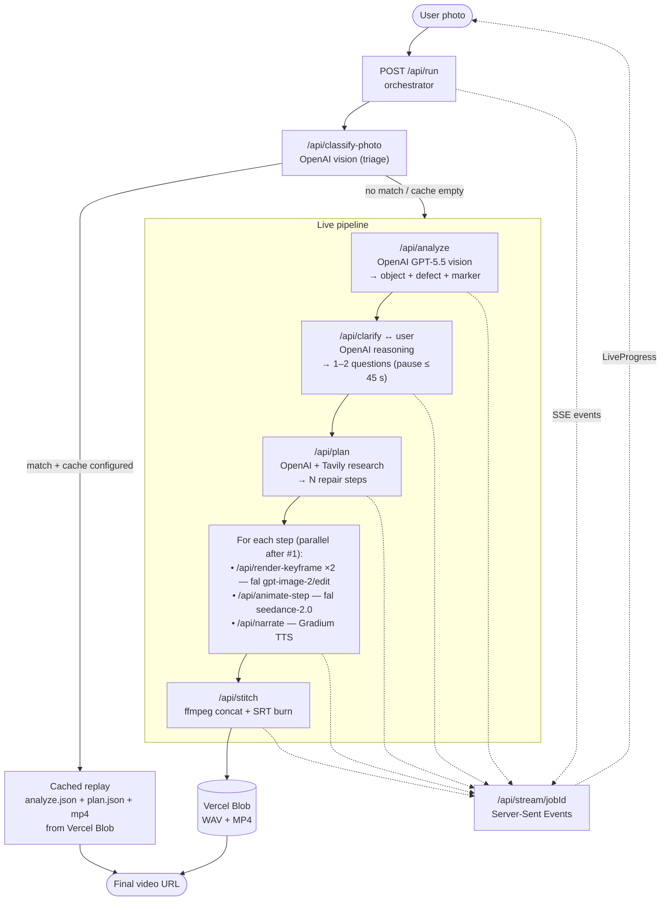

# Fixit — AI Repair Assistant

**Paris AI Hackathon 2026 · Tech: Europe · Open Innovation track**

From a photo of a broken object to a personalized step-by-step repair video in ~60–120 s — analyze, clarify, plan, render, animate, narrate and stitch run live, end-to-end, on whatever the user uploads.

> ⚡ Built on 4 of the hackathon's partner technologies: **OpenAI** (vision + reasoning + planning), **fal** (image edit + video gen), **Gradium** (TTS narration), **Tavily** (repair-knowledge research). No Anthropic or Gemini in the path — every textual decision is made by GPT-5.5, every frame is generated by fal, every voice line is synthesized by Gradium.

Fixit replaces the "watch a 20-minute YouTube tutorial that doesn't match your exact model" loop. The user (homeowner, cyclist, whoever just had something break) types nothing, just snaps the broken thing. Our orchestrator decides what's broken, asks one or two precise clarifying questions, builds a tailored repair procedure backed by web research, renders a per-step start/end keyframe of the user's own object on the user's own background, animates the in-between motion, narrates the steps in French, and stitches the lot into a captioned 720p MP4 with background music. The user opens their phone, taps the highlighted defect on their photo, and watches their own repair.

## How it answers the brief

Paris AI Hackathon · Open Innovation track gives full topic freedom + at least 1 partner tech. Here is how each partner is genuinely load-bearing, not just sprinkled on:

| Partner | Where it lives | Why it had to be here |
| --- | --- | --- |
| **OpenAI** (GPT-5.5) | `app/api/analyze/route.ts`, `clarify/route.ts`, `plan/route.ts`, `classify-photo/route.ts` | Vision-grade structured analysis of the photo (`object`, `defect`, `defect_marker` coordinates, `uncertainties` for clarify). Reasoning over the answers. Planning the multi-step procedure with budgeted total duration. |
| **fal** | `app/api/render-keyframe/route.ts` (`openai/gpt-image-2/edit`), `app/api/animate-step/route.ts` (`bytedance/seedance-2.0/image-to-video`) | The user's own photo is *edited* per step — we don't generate a generic scene, we transform the original input to show "your bike with the wheel off" then "your bike with the new inner tube fitted". `seedance-2.0` then animates the in-between, conditioned on a `motion_prompt` returned by the planner. |
| **Gradium** | `app/api/narrate/route.ts` (TTS REST, FR voice `YTpq7expH9539ERJ`, region `eu`) | One narration WAV per step, durations probed from the WAV header so `/api/stitch` can sync subtitles + clip length. |
| **Tavily** | `app/api/plan/route.ts` (research stage) | Grounds the GPT-5.5 plan in the actual repair web — bike tube sizes, iPhone display assemblies, faucet trap diameters. Robust to outage: empty research is non-fatal. |

The orchestrator (`/api/run`) emits the whole story as Server-Sent Events on `/api/stream/[jobId]` so the front-end shows each phase landing in real time. There is no fake "Loading…" — the user sees `analyze_done` → `clarify_needed` → `plan_done` → `keyframe_done` ×N → `animation_done` ×N → `narration_done` ×N → `stitch_done`.

## Architecture overview



## Live pipeline

When the user uploads (or clicks a demo card) the orchestrator runs:

```
1. CLASSIFY   /api/classify-photo      OpenAI vision (quick triage)
                                       → match one of 3 cached demos or 'none'
                                       → if hit + cache configured: serve cached
                                         analyze.json + plan.json + final.mp4

2. ANALYZE    /api/analyze             OpenAI · GPT-5.5 vision
                                       → AnalyzeResult: object, defect,
                                         defect_marker {x, y, label},
                                         feasibility_*, skill_level,
                                         safety_warnings, uncertainties[]

3. CLARIFY    /api/clarify             OpenAI · reasoning model
              /api/clarify-resolve     → polishes uncertainties into yes/no/MCQ
                                       → orchestrator pauses up to 45 s for
                                         user answers (Server-Sent Events)

4. PLAN       /api/plan                OpenAI + Tavily research
                                       → RepairPlan: N steps with
                                         visual_prompt_{start,end},
                                         motion_prompt, narration_fr,
                                         parts_needed, tools_needed,
                                         duration_seconds, total_duration_min

5. PER STEP (loop, step 1 sequential to measure latency, 2..N parallel):
   - RENDER   /api/render-keyframe ×2  fal · openai/gpt-image-2/edit
                                       → start keyframe (image_urls = user photo)
                                       → end keyframe (image_urls = start)
   - ANIMATE  /api/animate-step        fal · bytedance/seedance-2.0/image-to-video
                                       → 720p clip (start → end + motion_prompt)
   - NARRATE  /api/narrate             Gradium TTS
                                       → WAV + measured duration_ms

6. STITCH     /api/stitch              ffmpeg-static (Node)
                                       → concat clips + mix bg music + burn SRT
                                       → upload final MP4 to Vercel Blob
                                       → emit stitch_done with public URL
```

**Quality auto-tier.** Step 1 runs at `quality: 'high'`. If it crosses 25 s wall-clock, steps 2..N drop to `quality: 'medium'` to keep the whole job under the Vercel Hobby `maxDuration: 300` ceiling.

**Server-side photo.** The original upload is stashed in `lib/jobs.ts` and served via `/api/jobs/[id]/photo` so the job page has zero `sessionStorage` quota dependency.

**Demo cache.** Pre-shot demo photos can skip Analyze/Plan/Render/Animate/Narrate/Stitch entirely if the 3 `FIXIT_CACHE_<DEMO>_*` env vars are set (hand-tuned `analyze.json` + `plan.json` + `output.mp4` hosted on Vercel Blob). Each missing URL falls back to the live path — no partial fallback footguns.

## Demo objects

Three pre-shot photos drive the no-friction demo flow. Each runs the **same live pipeline** as a user upload — the demo card just provides the photo + a pre-recorded French voice transcript.

| ID | Category | Title | Pre-recorded user line |
| --- | --- | --- | --- |
| `flat-tire` | Bicycle | Fix a flat bike tire | « J'ai crevé en allant bosser et je veux pas appeler un pro » |
| `cracked-screen` | Electronics | Diagnose a cracked iPhone screen | « Mon écran est fissuré, est-ce que je peux le réparer moi-même ou il faut un pro ? » |
| `dripping-faucet` | Plumbing | Fix a dripping faucet | « Mon robinet fuit à la base, c'est urgent, je veux pas appeler un plombier » |

Photos under `public/demos/<id>/*.png`. Metadata + UI labels + marker coordinates in `lib/demos/index.ts`.

## Stack

- **Next.js 16.2** (App Router, React 19, Server Components, Server Actions)
- **AI SDK 5** + `@ai-sdk/openai` — typed wrappers around OpenAI Responses API
- `@fal-ai/client` — REST wrapper over fal queue (image edit + video gen)
- `@tavily/core` — research stage of the planner
- `@vercel/blob` — narration WAV + final MP4 storage (public + random suffix → unguessable URLs)
- `ffmpeg-static` — concat + mix + burn SRT in `/api/stitch` (runs in a Node Function, not Edge — `runtime: 'nodejs'`, `memory: 2048`, `maxDuration: 300`)
- `zod` — every request/response on every API route is parsed twice (incoming + outgoing) so types and runtime stay in lockstep
- **Vercel Fluid Compute** — single instance, in-memory SSE channels (`lib/jobs.ts`), no Redis dependency in default config
- **Tailwind 4** + **Biome 2** — front-end + lint/format
- **pnpm 9**, **Node 20+** (Vercel runs 24 LTS)

## Quick start

```bash
pnpm install
cp .env.example .env.local        # fill in the keys you have
pnpm dev                          # http://localhost:3000
```

Open `http://localhost:3000`, click **Demo mode** for a guaranteed-working flow on a pre-shot photo, or **Try your own** to drop in an actual broken-object photo and watch the live pipeline run.

## Environment variables

All keys are optional except `OPENAI_API_KEY` if you want the custom-photo flow to work past `/api/analyze`. Each integration is wired with a graceful fallback or a clear-cut failure boundary, never a silent degradation.

| Variable | Used by | Behaviour without it |
| --- | --- | --- |
| `OPENAI_API_KEY` | `analyze`, `clarify`, `clarify-resolve`, `classify-photo`, `plan` | Live photo flow fails at step 1. Demo cards still work if the demo cache is configured. |
| `FAL_KEY` | `render-keyframe`, `animate-step` | Live flow fails after `plan_done`. Demo cache replays unaffected. |
| `GRADIUM_API_KEY` | `narrate` | Pipeline fails after `animation_done`. Demo cache replays unaffected. |
| `GRADIUM_TTS_VOICE_ID` | `narrate` | Defaults to `YTpq7expH9539ERJ` (FR flagship). |
| `GRADIUM_REGION` | `narrate` | `eu` (default) or `us`. |
| `TAVILY_API_KEY` | `plan` (research) | Plan still generates, just without web-grounded parts/tools. Non-fatal. |
| `BLOB_READ_WRITE_TOKEN` | `narrate`, `stitch` | In dev: falls back to `public/_local-blob/`. In prod: `lib/blob.ts` throws. |
| `FIXIT_CACHE_FLAT_TIRE_{ANALYZE,PLAN,VIDEO}` | `/api/run` cache router | Demo card runs the full live pipeline instead of the cached replay. |
| `FIXIT_CACHE_CRACKED_SCREEN_{ANALYZE,PLAN,VIDEO}` | idem | idem |
| `FIXIT_CACHE_DRIPPING_FAUCET_{ANALYZE,PLAN,VIDEO}` | idem | idem |
| `UPSTASH_REDIS_REST_URL` / `_TOKEN` | (optional) | Not wired by default — `lib/jobs.ts` uses in-memory channels. |

Hackathon credit codes in `.env.example` comments where relevant (fal `paris-hack`, Gradium `PARISHAC1`, Tavily `TVLY-HBFB4VJ0`).

## Demo flow

1. Land on `/` — choose **Demo mode** (3 sample repairs) or **Try your own** (upload).
2. **Demo mode** → pick a guide card (Bicycle / Electronics / Plumbing) → photo loads → tap **Troubleshoot →**.
3. **Try your own** → drop a photo (PNG/JPG/WebP, ≤ 10 MB) → the live pipeline starts immediately.
4. The **Job** page splits into two columns:
   - Left: your photo with a pulsing red marker on the detected defect, plus a Watch CTA when the video is ready.
   - Right: `<LiveProgress>` streams each pipeline event as it lands — analyze, clarify (interactive), plan, per-step keyframes/animation/narration, final stitch.
5. Tap the marker → modal opens with the captioned MP4 + background music + voice-over.

## Repo structure

```
app/
├── page.tsx                         Landing — chooser (Demo mode / Try your own)
├── demo/[id]/page.tsx               Demo intro — photo + Troubleshoot CTA
├── job/[id]/page.tsx                Live job — photo + marker + LiveProgress + VideoModal
├── layout.tsx                       Root layout + metadata
└── api/
    ├── analyze/route.ts             OpenAI · GPT-5.5 vision → AnalyzeResult
    ├── clarify/route.ts             OpenAI · polish uncertainties into Q&A
    ├── clarify-resolve/route.ts     Receive user answers, unblock the orchestrator
    ├── classify-photo/route.ts      Quick triage: bike / phone / faucet / none
    ├── plan/route.ts                OpenAI + Tavily → RepairPlan
    ├── render-keyframe/route.ts     fal · gpt-image-2/edit (start + end frames)
    ├── animate-step/route.ts        fal · seedance-2.0 image-to-video
    ├── narrate/route.ts             Gradium TTS → WAV + duration_ms
    ├── stitch/route.ts              ffmpeg-static → final MP4 + SRT burn-in
    ├── run/route.ts                 Orchestrator (cache router + live pipeline)
    ├── stream/[jobId]/route.ts      SSE event stream consumed by LiveProgress
    └── jobs/[id]/photo/route.ts     Serves the uploaded photo back to the client

components/
├── DemoCard.tsx                     Home grid card (real photo via demo.photo_url)
├── PhotoUpload.tsx                  Drag-and-drop + data-URL encode → POST /api/run
├── LiveProgress.tsx                 SSE consumer, renders the chain of phases
├── VideoModal.tsx                   Full-screen player after stitch_done
└── VideoPlayer.tsx                  <video> wrapper with captions toggle

lib/
├── types.ts                         Single source of truth — all zod schemas
│                                    (AnalyzeResult, RepairPlan, RepairStep,
│                                     StreamEvent union, DefectMarker, …)
├── env.ts                           Process-wide env validation (zod)
├── openai.ts                        AI SDK client wrappers + model selector
├── fal.ts                           Thin REST over fal queue (no @fal-ai/client)
├── gradium.ts                       TTS REST client + WAV duration probe
├── tavily.ts                        Research helper for /api/plan
├── blob.ts                          @vercel/blob wrapper + dev local fallback
├── jobs.ts                          In-memory job channels (SSE + clarify resume)
├── sse.ts                           Server-Sent Events helpers
├── demo-cache.ts                    FIXIT_CACHE_* env router
└── demos/index.ts                   3-demo registry (photo + transcript + UI labels)

public/
├── logo.webp                        Trimmed wordmark used in every header
└── demos/                           Pre-shot demo photos (bike.png, phone.png, Fuite.png)

scripts/
├── test-analyze.sh                  curl /api/analyze with a sample photo
├── test-clarify.sh                  Stand-alone clarify probe
├── test-plan.sh                     curl /api/plan
├── test-pipeline.sh                 Full local run with a fixed photo
├── test-multi-step.mjs              Parallel keyframe×N + animate + narrate harness
├── upload-image.mjs                 Push a local image to Vercel Blob (one-shot)
└── plans/                           Cached `RepairPlan` fixtures used by tests
```

## Scripts

```bash
pnpm dev                  # next dev (http://localhost:3000)
pnpm build                # next build
pnpm start                # next start (prod)
pnpm lint                 # biome lint .
pnpm format               # biome format --write .
pnpm check                # biome check --write . (lint + format + organize imports)
pnpm typecheck            # tsc --noEmit
```

Helper shell scripts (require a running dev server):

```bash
./scripts/test-analyze.sh        # POST /api/analyze with public/demos/flat-tire/bike.png
./scripts/test-clarify.sh        # POST /api/clarify with an AnalyzeResult fixture
./scripts/test-plan.sh           # POST /api/plan after analyze + clarify
./scripts/test-pipeline.sh       # End-to-end against the live dev server
node scripts/test-multi-step.mjs # Stress-test the per-step parallel batch
```

## Deployment

Deployed on **Vercel** (Fluid Compute, Node 24 LTS, region `iad1`).

```bash
vercel link
vercel env pull .env.local       # pulls every key including BLOB_READ_WRITE_TOKEN
vercel deploy                    # preview
vercel deploy --prod             # production
```

Function tuning in `vercel.json` — capped to Hobby-plan limits (`maxDuration: 300`, `memory: 2048`). The orchestrator auto-downgrades render quality (`high → medium`) after 25 s on step 1 so the whole job stays comfortably under 5 min.

## Submission

Per Paris AI Hackathon rules:

- ✅ Public GitHub repo with README + setup instructions (this file)
- ✅ ≥ 1 partner technology — uses **4** (OpenAI, fal, Gradium, Tavily)
- ✅ Newly created at the hackathon (initial scaffold from `create-next-app`)
- ✅ Team ≤ 5 — 4 devs split as **Dev A** (front-end, chat + marker), **Dev B** (analyze + clarify), **Dev C** (generation pipeline: render / animate / narrate / stitch), **Dev D** (live orchestrator + SSE)
- 🎥 2-min Loom demo: submitted via the project form

## Track

**Open Innovation** — full topic freedom. We aim at technical complexity (7 API routes wired into a single SSE-driven orchestrator with auto-quality downgrade, server-side photo handoff, demo cache router) and partner-tech depth (4 of 4 listed AI partners genuinely load-bearing in the path, not bolted on).
