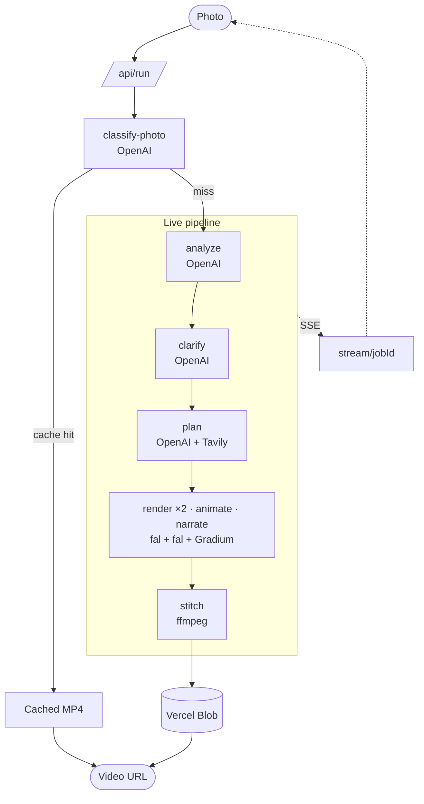

# Fixit · AI Repair Assistant

**Paris AI Hackathon 2026 · Open Innovation track · fal side challenge**

From a photo of a broken object to a personalized step-by-step repair video in ~60-120 s. Analyze, clarify, plan, render, animate, narrate, stitch: all live, end-to-end.

Snap the broken thing. The orchestrator decides what's broken, asks one or two clarifying questions, plans the procedure with web-grounded research, generates a per-step start/end keyframe of the user's *own* photo, animates the in-between, narrates in French, and stitches a captioned 720p MP4 with background music.

## Partner technologies

| Partner | Where | What it does |
| --- | --- | --- |
| **fal** *(side challenge entry)* | `render-keyframe` (`openai/gpt-image-2/edit`), `animate-step` (`bytedance/seedance-2.0/image-to-video`) | Two fal models chained per repair step. Image edit transforms the user's actual photo into "step start" then "step end" frames. Image-to-video animates the in-between, conditioned on a planner-emitted motion prompt. |
| OpenAI (GPT-5.5) | `analyze`, `clarify`, `clarify-resolve`, `classify-photo`, `plan` | Vision-grade structured analysis (object, defect, marker coordinates, uncertainties). Reasoning over the answers. Multi-step planning with a duration budget. |
| Gradium | `narrate` | French TTS per step (voice `YTpq7expH9539ERJ`, `eu` region). WAV duration probed from the header so `stitch` can align subtitles. |
| Tavily | `plan` (research stage) | Grounds the plan in the actual repair web: bike tube sizes, iPhone display assemblies, faucet trap diameters. |

## Architecture



**Quality auto-tier.** Step 1 runs at `quality: 'high'`; if it crosses 25 s, steps 2..N drop to `medium` so the whole job stays under `maxDuration: 300`.

## Stack

Next.js 16.2 (App Router, React 19), AI SDK 5 + `@ai-sdk/openai`, `@fal-ai/client`, `@tavily/core`, `@vercel/blob`, `ffmpeg-static`, `zod`. Tailwind 4 + Biome 2, pnpm 9, Node 20+. Deployed on Vercel Fluid Compute.

## Quick start

```bash
pnpm install
cp .env.example .env.local        # fill in the keys
pnpm dev                          # http://localhost:3000
```

Open `/`, click **Demo mode** (pre-shot photo) or **Try your own** (drop your own image).

## Environment variables

| Variable | Required? | Used by |
| --- | --- | --- |
| `OPENAI_API_KEY` | yes (live path) | analyze, clarify, plan, classify-photo |
| `FAL_KEY` | yes (live path) | render-keyframe, animate-step |
| `GRADIUM_API_KEY` | yes (live path) | narrate |
| `TAVILY_API_KEY` | optional | plan research (graceful fallback) |
| `BLOB_READ_WRITE_TOKEN` | yes in prod | narrate, stitch (dev falls back to `public/_local-blob/`) |
| `FIXIT_CACHE_<DEMO>_{ANALYZE,PLAN,VIDEO}` | optional | demo cache router; if all 3 set, skip live pipeline |

Hackathon credit codes in `.env.example` (fal `paris-hack`, Gradium `PARISHAC1`, Tavily `TVLY-HBFB4VJ0`).

## Repo structure

```
app/
├── page.tsx                     Chooser: Demo mode / Try your own
├── demo/[id]/page.tsx           Demo intro + Troubleshoot button
├── job/[id]/page.tsx            Live photo + marker + LiveProgress + video
└── api/
    ├── run/                     Orchestrator (cache router + live pipeline)
    ├── stream/[jobId]/          SSE event stream
    ├── analyze/                 OpenAI vision
    ├── clarify/, clarify-resolve/ OpenAI reasoning + interactive Q&A
    ├── classify-photo/          Quick demo triage
    ├── plan/                    OpenAI + Tavily
    ├── render-keyframe/         fal gpt-image-2/edit
    ├── animate-step/            fal seedance-2.0
    ├── narrate/                 Gradium TTS
    ├── stitch/                  ffmpeg concat + SRT burn
    └── jobs/[id]/photo/         Serves the uploaded photo back

components/                       DemoCard, PhotoUpload, LiveProgress, VideoModal, VideoPlayer
lib/                              types (zod schemas), env, openai, fal, gradium, tavily,
                                  blob, jobs (in-mem SSE), sse, demo-cache, demos registry
public/demos/                     Pre-shot photos (bike, phone, faucet)
```

## Demos

Three pre-shot photos drive the no-friction demo flow. Each runs the **same live pipeline** as a user upload.

| ID | Category | Title |
| --- | --- | --- |
| `flat-tire` | Bicycle | Fix a flat bike tire |
| `cracked-screen` | Electronics | Diagnose a cracked iPhone screen |
| `dripping-faucet` | Plumbing | Fix a dripping faucet |

## Submission

- Public repo with README + setup: ✅
- ≥ 1 partner technology: uses **4** (OpenAI, **fal**, Gradium, Tavily)
- Newly created at the hackathon
- Team of 4
- **Side challenge: fal** · two fal models (`gpt-image-2/edit` + `seedance-2.0`) chained per repair step, edits of the user's actual photo, not synthetic scenes
- 2-min Loom demo · submitted via the project form

## Scripts

```bash
pnpm dev          # next dev
pnpm build        # next build
pnpm lint         # biome lint .
pnpm format       # biome format --write .
pnpm typecheck    # tsc --noEmit
```
